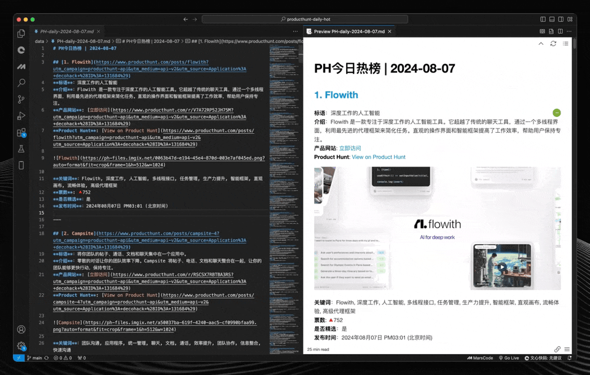

# Product Hunt Daily Hot List

[English](README.md) | [中文](README.zh.md)

 

Product Hunt Daily Hot is a GitHub Action-based automation tool that generates a daily Markdown file summarizing the top products from Product Hunt and automatically commits it to a GitHub repository. The project aims to help users quickly view the daily Product Hunt leaderboard and provide more detailed product information.

[🌐 View here](https://decohack.com/category/producthunt/).

## Preview



## Features

- **Automated Data Retrieval**: Automatically retrieves the top 30 products from Product Hunt from the previous day.
- **Keyword Generation**: Generates easy-to-understand Chinese keywords to help users better understand the product content.
- **High-Quality Translation**: Uses OpenAI's GPT-4 model to perform high-quality translations of product descriptions.
- **Markdown File Generation**: Generates Markdown files containing product data, keywords, and translated descriptions, which can be easily published on websites or other platforms.
- **Daily Automation**: Automatically generates and commits the daily Markdown file via GitHub Actions.
- **Configurable Workflow**: Supports manual triggering or scheduled generation via GitHub Actions.
- **Flexible Customization**: The script is easy to extend or modify to include additional product details or adjust the file format.
- **Automatic Publishing to WordPress**: The generated Markdown files can be automatically published to a WordPress website.

## Getting Started

### Prerequisites

- Python 3.x
- GitHub account and repository
- OpenAI API Key
- Product Hunt Developer Token (obtained from Product Hunt Developer Settings)
- WordPress website and credentials (for automatic publishing)

### Installation

1. **Clone the repository:**

```bash
git clone https://github.com/ViggoZ/producthunt-daily-hot.git
cd producthunt-daily-hot
```

2. **Install Python dependencies:**

Ensure you have Python 3.x installed. Then, install the required packages:

```bash
pip install -r requirements.txt
```

### Setup

1. **GitHub Secrets:**

   Add the following secrets to your GitHub repository:

   - `OPENAI_API_KEY`: Your OpenAI API key
   - `PRODUCTHUNT_DEVELOPER_TOKEN`: Your Product Hunt Developer Token
   - `PAT`: Personal Access Token for pushing changes to the repository
   - `WORDPRESS_URL`: Your WordPress website URL
   - `WORDPRESS_USERNAME`: Your WordPress username
   - `WORDPRESS_PASSWORD`: Your WordPress password

2. **Get Product Hunt Developer Token:**

   1. Visit [Product Hunt Developer Settings](https://www.producthunt.com/v2/oauth/applications)
   2. Log in to your account
   3. Create a new application in the developer settings
   4. Obtain the Developer Token

3. **GitHub Actions Workflow:**

   The workflow is defined in `.github/workflows/generate_markdown.yml` and `.github/workflows/publish_to_wordpress.yml`. It runs daily at 07:01 UTC (15:01 Beijing Time) and can also be manually triggered.

### Usage

Once set up, the GitHub Action will automatically generate and commit a Markdown file each day with the top products from Product Hunt, and automatically publish it to your WordPress website. These files are stored in the `data/` directory.

### Customization

- Modify `scripts/product_hunt_list_to_md.py` to customize the format or add additional content.
- Adjust the schedule in `.github/workflows/generate_markdown.yml` if needed.

### Example Output

The generated files are stored in the `data/` directory. Each file is named in the format `PH-daily-YYYY-MM-DD.md`.

### Contributing

Contributions are welcome! Please open an issue or submit a pull request for any improvements or new features.

### License

This project is licensed under the MIT License - see the [LICENSE](LICENSE) file for details.


---

# My Open Source Domain Story: A Brand, Product, and Growth Journey from a "Non-Programmer" E-commerce Operator

Hi, I'm Charlie.

To be honest, I'm not a programmer. I don't know products, traffic, operations, marketing, or branding. My main job is Amazon e-commerce operations, as a third-party seller. I'm an outsider to the Internet, code, products, and brands. I grew up in an ordinary family and didn't touch a computer until college. At that time, I was curious about Python and programming, but the theory was too boring, and I couldn't get into video courses. Even now, five years after graduation, I still can't code, but I've always had respect and gratitude for "code."

---

## Why this open source project?

Honestly, I didn't understand open source, branding, copyright, traffic, or products at first. I was just an e-commerce operator, doing business under platform rules, feeling it was getting harder, and wanting to find a new way out. One day, I discovered Product Hunt, with so many new products, ideas, and trends every day. I was curious about the data, innovations, and logic behind these products. So I started researching, even "borrowing" the brand, bought a .ai domain, just because it sounded good, and put up an open source navigation project. The data wasn't much different from others. Later, I found that even with little traffic, Google indexed it. This made me realize that even a small attempt can be seen by the world.

But I wasn't satisfied with "copy-paste." I wanted to create something of my own. So I started thinking: can I use this domain to make an open source project that aggregates product data, APIs, and registration info, maybe even a "dashboard" for more people to use and see?

---

## Brand, Copyright, and Risk: My "Late Realization" and Respect

Frankly, I had no concept of brand, copyright, or domain risk at first. I just thought the brand was cool, the domain was handy, so I bought it. I didn't check trademarks or have brand awareness, just thought it was fun. Later, I realized there are risks, especially with well-known brands.

I used this brand's app data and products, indeed "borrowed" some brand heat, but had no malicious intent. I just wanted to do something interesting in my own way and study the data and trends of these innovative products.

Now I respect brands and copyrights very much, and I'm willing to make all project content public, with no commercial purpose or malice. **This article is to clearly express my respect for the brand, domain, and website. All my project content is open and transparent, with no malice or commercial purpose.** If the brand owner ever wants the domain back, I'll transfer it to them. After all, it's their brand, and I'm just a "dreamer passing by." But before that, I hope to use this domain to create something valuable, even if it's just an open source sample room.

---

## My Growth and Identity: Facing My "Ignorance" Honestly

I'm not a product manager, programmer, traffic expert, marketing guru, or brand specialist. I'm just an ordinary e-commerce operator, relying on understanding rules and a bit of execution on Amazon. I'm interested in code but never learned it. I'm interested in products but never made one. I don't understand branding, traffic, marketing, or copyright. But I believe that as long as you're willing to try, learn, and experiment, even "cross-industry," you can create something interesting.

---

## Open Source, Donation, and Personal Brand: My Little Plan

I always felt the greatest charm of open source is not the code itself, but the connection between people. I hope to meet more like-minded friends through this project, even if it's just remote communication, it's a gain.

If one day this project gets some attention, I'll proactively contact the brand owner and express my willingness to donate. Not to "sell for a good price," but to tell a story of "open source, sharing, and win-win." Maybe they won't care, maybe they'll think I'm overdoing it, but that's okay. The important thing is I did what I wanted and left myself a memorable experience.

---

## Operation and Strategy: My Pragmatism

1. **Focus on content and technology**: Regardless of whether the domain can be sold, the project itself must be valuable.
2. **Improve documentation and story**: Write my intentions, story, and donation willingness clearly in the README, project homepage, and blog.
3. **Develop several related projects**: Form my own "open source product matrix" to enhance personal influence.
4. **Fixed contact information**: Use a dedicated email and Twitter account for easy contact with brand owners and developers.
5. **Don't worry or stress**: Decide whether to renew or give up the domain when it expires, go with the flow.
6. **If the brand owner wants the domain, I'll transfer it and write a good story, positive marketing.**  But more importantly, this article is to express my respect for the brand and cherish the domain—**I'm not using this domain for big business, but to leave something interesting for the brand, the industry, and myself through this project.**  If the brand owner needs it, I can transfer the domain to them at any time; if not, I'll keep renewing and maintaining the project until one day it's really valuable and worth attention.
7. **If the account is banned, it means I did something wrong, adjust in time, never violate the rules.**
8. **If no one cares about the project, treat it as practice and slowly build influence.**
9. **If all goes well, keep going and enjoy the fun of open source.**

---

## My Bottom Line and Dedication

- All content of this project is public, with no malice or commercial purpose.
- I'm always willing to donate the domain to the brand owner, even if they don't care now, they can contact me anytime in the future.
- I wrote this article to clarify my thoughts, story, bottom line, respect, and dedication.
- I believe the most valuable thing in life is the products and stories you leave behind.
- **My biggest motivation for this project is to make more products. For me, the greatest meaning in life is to turn my ideas into good products. Even a small open source project is worth taking seriously.**

---

## Conclusion: Be Yourself, Do Open Source with Warmth

I'm not a big shot or an influencer, just an ordinary person who likes to tinker. But I believe that as long as you do things with heart, even a small open source project can shine. I hope my story can inspire you, and you're welcome to communicate, complain, or collaborate.

**Open source is not just code, but the warmth between people.**

---

**Contact:**  
- Email: [hi@producthunt.ai]  

---

If you find my project interesting, feel free to Star, Fork, or open an Issue. Brand owners are also welcome to contact me anytime. If you have a similar story, feel free to share it, let's do something interesting together!

---

> This is my open source domain story, and also my thoughts on products, brands, and the future.  
> What about you? What's your story? 

