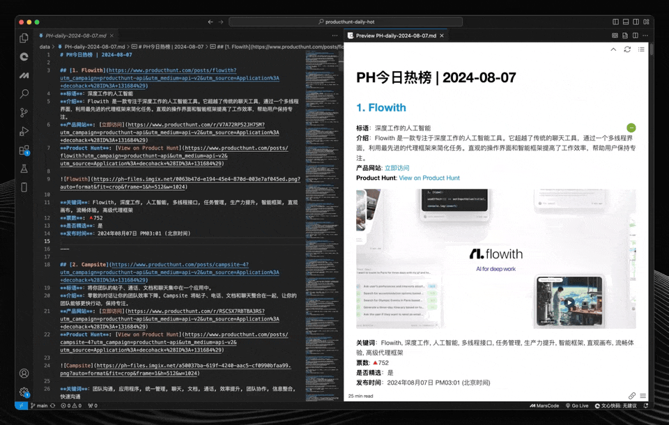

# Product Hunt 每日热榜

[English](README.md) | [中文](README.zh.md)

 

Product Hunt 每日热榜是一个基于 GitHub Action 的自动化工具，它能够每天定时生成 Product Hunt 上的热门产品榜单 Markdown 文件，并自动提交到 GitHub 仓库中。该项目旨在帮助用户快速查看每日的 Product Hunt 热门榜单，并提供更详细的产品信息。

榜单会在每天下午4点自动更新，可以在 [🌐 这里查看](https://decohack.com/category/producthunt/)。

## 预览



## 功能概述

- **自动获取数据**：每天自动获取前一天的 Product Hunt Top 30 产品数据。
- **关键词生成**：生成简洁易懂的中文关键词，帮助用户更好地理解产品内容。
- **高质量翻译**：使用 OpenAI 的 GPT-4 模型对产品描述进行高质量翻译。
- **Markdown 文件生成**：生成包含产品数据、关键词和翻译描述的 Markdown 文件，方便在网站或其他平台上发布。
- **每日自动化**：通过 GitHub Actions 自动生成并提交每日的 Markdown 文件。
- **可配置工作流**：支持手动触发或通过 GitHub Actions 定时生成内容。
- **灵活定制**：脚本易于扩展或修改，可以包括额外的产品细节或调整文件格式。
- **自动发布到 WordPress**：生成的 Markdown 文件可以自动发布到 WordPress 网站。

## 快速开始

### 前置条件

- Python 3.x
- GitHub 账户及仓库
- OpenAI API Key
- Product Hunt Developer Token (从 Product Hunt 开发者设置页面获取)
- WordPress 网站及凭证（用于自动发布）

### 安装

1. **克隆仓库：**

```bash
git clone https://github.com/ViggoZ/producthunt-daily-hot.git
cd producthunt-daily-hot
```

2. **安装 Python 依赖：**

确保您的系统已安装 Python 3.x。然后安装所需的依赖包：

```bash
pip install -r requirements.txt
```

### 设置

1. **GitHub Secrets：**

   在您的 GitHub 仓库中添加以下 Secrets：

   - `OPENAI_API_KEY`: 您的 OpenAI API 密钥
   - `PRODUCTHUNT_DEVELOPER_TOKEN`: 您的 Product Hunt Developer Token
   - `PAT`: 用于推送更改到仓库的个人访问令牌
   - `WORDPRESS_URL`: 您的 WordPress 网站 URL
   - `WORDPRESS_USERNAME`: 您的 WordPress 用户名
   - `WORDPRESS_PASSWORD`: 您的 WordPress 密码

2. **获取 Product Hunt Developer Token：**

   1. 访问 [Product Hunt 开发者设置页面](https://www.producthunt.com/v2/oauth/applications)
   2. 登录您的账户
   3. 在开发者设置中创建一个新的应用
   4. 获取 Developer Token

3. **GitHub Actions 工作流：**

   工作流定义在 `.github/workflows/generate_markdown.yml` 和 `.github/workflows/publish_to_wordpress.yml` 中。该工作流每天 UTC 时间 07:01（北京时间 15:01）自动运行，也可以手动触发。

### 使用

设置完成后，GitHub Action 将自动生成并提交包含 Product Hunt 每日热门产品的 Markdown 文件，并自动发布到 WordPress 网站。文件存储在 `data/` 目录下。

### 自定义

- 您可以修改 `scripts/product_hunt_list_to_md.py` 文件来自定义生成文件的格式或添加额外内容。
- 如果需要，可以在 `.github/workflows/generate_markdown.yml` 中调整定时任务的运行时间。

### 示例输出

生成的文件存储在 `data/` 目录下。每个文件以 `PH-daily-YYYY-MM-DD.md` 的格式命名。

### 贡献

欢迎任何形式的贡献！如有任何改进或新功能的建议，请提交 issue 或 pull request。

### 许可证

本项目基于 MIT 许可证开源 - 有关详细信息，请参阅 [LICENSE](LICENSE) 文件。


# 我的开源域名故事：一个“非程序员”电商人的品牌、产品与成长自述

大家好，我是Charlie。

坦白说，我不是程序员，不懂产品、不懂流量、不懂运营、不懂营销，也不懂品牌。我的主业其实是做亚马逊电商运营，算是第三方卖家出身。  
我对互联网、对代码、对产品、对品牌，其实一直是“门外汉”。我出生在一个普通家庭，小学、初中、高中都没接触过电脑，直到大学才第一次摸到键盘。那时候我就对Python、对编程充满好奇，但理论太枯燥，视频课程也看不进去。哪怕到现在，大学毕业五年了，我依然不会写代码，但我一直对“代码”这东西充满敬畏和感激。

---

## 为什么会有这个开源项目？

说实话，我最初对开源、对品牌、对版权、对流量、对产品……全都不懂。  
我只是一个电商运营，做着平台规则下的生意，越来越觉得难做，越来越想找点新出路。  
有一天，我发现了Product Hunt这个平台，发现它每天都有那么多新产品、新点子、新趋势。我很好奇，这些产品的数据、创新点、背后的逻辑到底是什么？  
我就开始研究，甚至“蹭”了一下品牌，买了一个.ai后缀的域名，最开始只是觉得名字好听，顺手就挂了个开源导航项目，数据也没怎么改，和别人网站内容都差不多。  
后来发现，虽然没什么流量，但谷歌居然也收录了。这让我意识到，哪怕是一个小小的尝试，也可能被世界看到。

但我不满足于“复制粘贴”，我想做点真正属于自己的东西。于是我开始琢磨，能不能用这个域名，做一个聚合产品数据、API、注册信息的开源项目，甚至做成一个“控制面板”，让更多人用得上、看得见。

---

## 品牌、版权和风险：我的“后知后觉”与尊重

坦白说，最开始我对品牌、版权、域名风险**完全没有概念**。  
我只是觉得这个品牌很酷，域名也很顺手，就买了。没有去查询品牌，也没有品牌意识，只是觉得有意思、顺手就做了。  
后来慢慢明白，品牌和域名其实是有风险的，尤其是和知名品牌撞名的时候。

我用的是这个品牌的App的数据和产品，确实是“蹭”了一下品牌的热度，但我没有任何恶意。  
我只是想用自己的方式，做点有意思的事情，顺便研究一下这些创新产品的数据和趋势。

现在我非常尊重品牌和版权，也愿意把所有项目内容都公开，完全没有任何商业目的和恶意。  
**我写这篇文章，就是要鲜明表达：我对这个品牌、域名、网站都充满敬意和尊重。我的所有项目内容都公开透明，没有任何恶意和商业目的。**  
如果哪天品牌方真的找上门来要回域名，我会很坦然地转让给他们。毕竟，这本来就是他们的品牌，我只是一个“路过的造梦者”。  
但在那之前，我希望能用这个域名，做出点有价值的东西，哪怕只是一个开源的样板间。

---

## 我的成长与身份：坦诚面对自己的“不懂”

我不是产品经理，不是程序员，不是流量大佬，不是营销高手，也不是品牌专家。  
我只是一个普通的电商运营，靠着对规则的理解和一点点执行力，在亚马逊平台上摸爬滚打。  
我对代码一直很感兴趣，但一直没学会。  
我对产品很感兴趣，但一直没做过。  
我对品牌、流量、营销、版权……全都不懂。  
但我相信，只要愿意折腾，愿意学习，愿意尝试，哪怕是“跨行”，也能做出点有意思的东西。

---

## 开源、捐赠与个人品牌：我的小算盘

我一直觉得，开源最大的魅力，不是代码本身，而是人与人之间的连接。  
我希望通过这个项目，结识更多志同道合的朋友，哪怕只是远程交流，也是一种收获。

如果有一天，这个项目真的有了点热度，我会主动联系品牌方，表达我的捐赠意愿。  
不是为了“卖个好价钱”，而是想讲一个“开源、分享、共赢”的故事。  
也许他们不会理我，也许他们会觉得我多此一举，但这都无所谓。  
重要的是，我做了自己想做的事，也给自己留下一段值得回忆的经历。

---

## 操作与策略：我的实用主义

1. **专注内容和技术**：不管域名能不能卖出去，项目本身要有价值。
2. **完善文档和故事**：在 README、项目主页、博客里写清楚我的初衷、故事和捐赠意愿。
3. **多开发几个相关项目**：形成自己的“开源产品矩阵”，提升个人影响力。
4. **固定联系方式**：用专门的邮箱、推特账号，方便品牌方和开发者联系我。
5. **不纠结、不焦虑**：域名快到期时再决定续费或放弃，顺其自然。
6. **如果品牌方要回域名，我就主动转让，写好故事，正面营销。**  
   但更重要的是，我写这篇文章，就是为了表达我对品牌的尊重和对域名的珍惜——**我不是为了用这个域名去做什么大生意，而是想通过这个项目，给品牌、给行业、给自己留下一点有意思的东西。**  
   如果品牌方需要，我随时可以把域名转让给他们；如果不需要，我也会持续续费、持续维护这个项目，直到有一天它真的有价值、值得被关注。
7. **如果账号被封，说明我哪里做错了，及时调整，绝不违规。**
8. **如果项目没人关注，那就当是给自己练手，慢慢积累影响力。**
9. **如果一切顺利，那就继续做下去，享受开源带来的乐趣。**

---

## 我的底线与奉献

- 这个项目所有内容都公开，完全没有任何恶意和商业目的。
- 我随时愿意把域名捐赠给品牌方，哪怕他们现在不理我，未来有需要随时联系我都可以。
- 我写这篇文章，就是想把我的想法、我的故事、我的底线、我的尊重、我的奉献都说清楚。
- 我相信，人生最有价值的，就是你留下的产品和故事。
- **我做这个项目的最大动力，就是想多做一些产品。对我来说，人生最大的意义，就是把自己的想法变成一个好产品。哪怕只是一个小小的开源项目，也值得被认真对待。**

---

## 结语：做自己，做有温度的开源

我不是大牛，也不是网红，只是一个喜欢折腾的普通人。  
但我相信，只要用心做事，哪怕是一个小小的开源项目，也能发光发热。  
希望我的故事，能给你一些启发，也欢迎你来交流、吐槽、合作。

**开源不止是代码，更是人与人之间的温度。**

---

**联系方式：**  
- Email: [hi@producthunt.ai]  

---

如果你觉得我的项目有意思，欢迎 Star、Fork、提 Issue，也欢迎品牌方随时联系我。  
如果你有类似的故事，也欢迎和我分享，我们一起做点有意思的事情！

---

> 这就是我的开源域名故事，也是我对产品、品牌和未来的思考。  
> 你呢？你的故事是什么？


